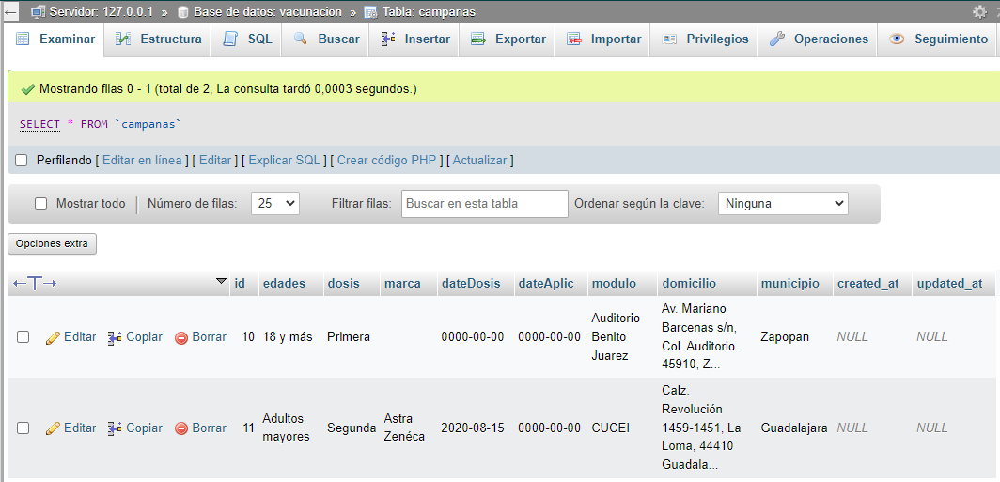
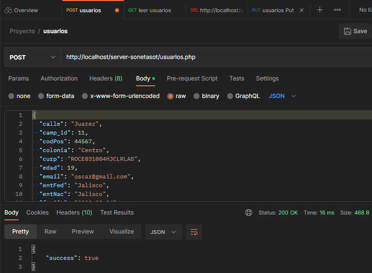
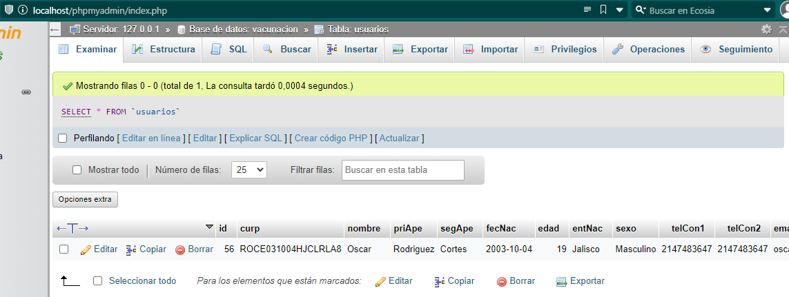
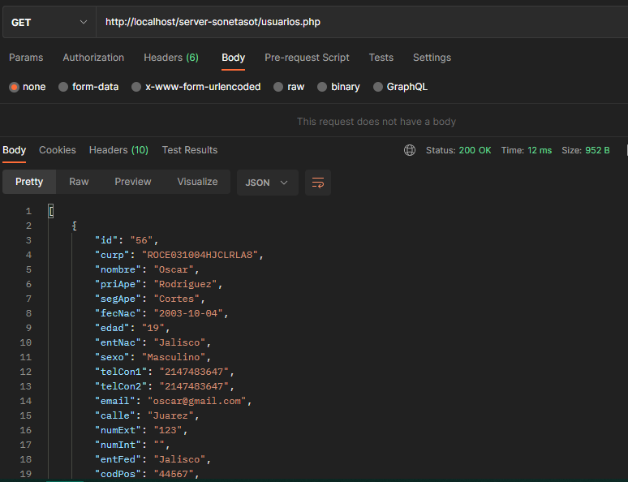
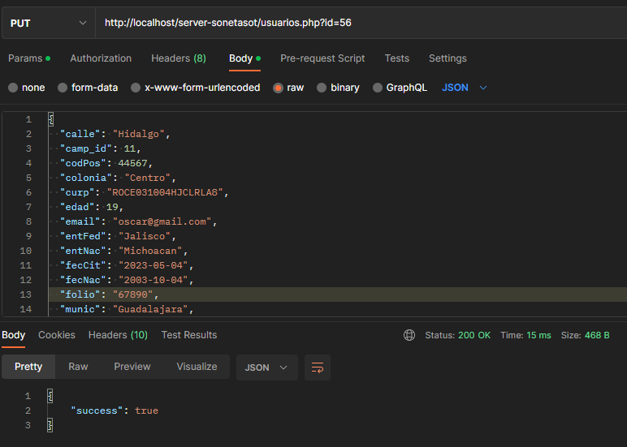
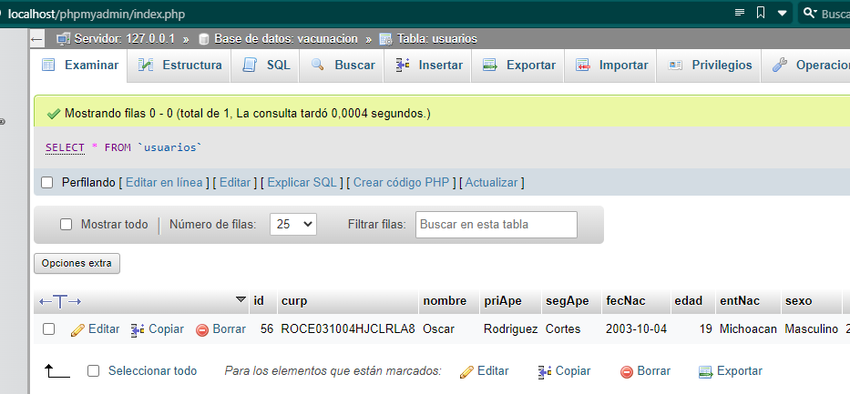
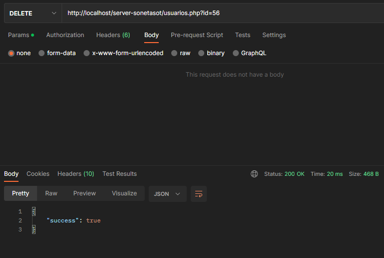

## Server
Este proyecto está generado con [Laravel Framework]("https://laravel.com) 9.52.5, Composer version 2.5.5 y XAMPP Control Panel versión 3.3.0.

Es necesario ejecutar el comando `composer install` en la carpeta del proyecto para instalar las dependencias del proyecto.

Se abre el Panel de Control de XAMPP y se inicia Apache y MySQL.

## Base de datos

Se crea la base de datos ***vacunacion***, una vez creada se abre una terminal en la carpeta del proyecto y se ejecuta el comando `php artisan migrate`, esto migrará las tablas a la base de datos.

Una vez creada la base de datos es recomendable crear registros para la tabla de campañas para que se pueda utilizar las funcionalidades en el frontend, en este caso se tiene un archivo `campanas.sql` para poder importar dos registros de campañas.

## Métodos

### POST

Con este método se añaden nuevos registros a la base de datos, en este caso toma el registro que se tenga en formato JSON y añade todos los campos necesarios, desde el forntend se encuentran las validaciones necesarias para que se envien los datos correctamente.

Este método solo esta implementado para la tabla usuarios, la petición es hecha con la query correspondiente desde `/server-sonetasot/usuarios.php` enviando el método POST.

### GET

Con este método se obtienen los registros de las tablas de la base de datos, se toman todos los registros en formato JSON y se muestran con validaciones en el frontend.

Este método esta implementado para la tabla usuarios y campañas, la petición es hecha con la query correspondiente desde `/server-sonetasot/usuarios.php` y `/server-sonetasot/campanas.php` enviando el método GET.

### PUT

Con este método se actualiza un registro a la base de datos, es necesario enviar el ID del registro que se quiere actualizar, se toma el registro que se obtenga en formato JSON y se añaden todos los campos para actualizar el registro, desde el forntend se encuentran las validaciones necesarias para que se envien los datos correctamente.

Este método solo esta implementado para la tabla usuarios, la petición es hecha con la query correspondiente desde `/server-sonetasot/usuarios.php` concatenando la cadena `?id=` y añadiendo el ID del registro, y enviando el método PUT.

### DELETE

Con este método se elimina el registro en la base de datos, es necesario enviar el ID del registro que se quiere eliminar, se toma el registro que se obtenga en formato JSON y se elimina de la tabla.

Este método solo esta implementado para la tabla usuarios, la petición es hecha con la query correspondiente desde `/server-sonetasot/usuarios.php` concatenando la cadena `?id=` y añadiendo el ID del registro, y enviando el método DELETE.

